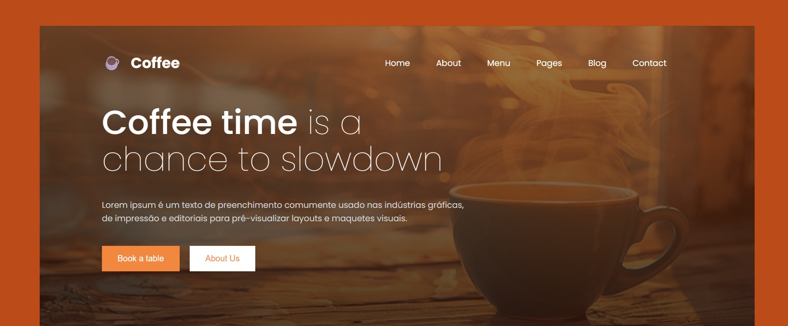

☕Coffee Landing Page

Uma landing page responsiva de cafeteria desenvolvida com HTML e CSS, focada em layout moderno, hero section e responsividade mobile.

🚀Tecnologias utilizadas

.HTML5 
.CSS3 
.Google Fonts (Poppins)

🎯Funcionalidades

.Hero section com imagem de fundo 
.Navbar estilizada 
.Layout responsivo para mobile 
.Botões personalizados 
.Seção "Our Skills" 
.Estilização moderna com gradientes e tipografia 

📱Responsividade 

O proheto foi adaptado para diferentes tamanhos de tela, incluindo dispositivos móveis.

📚Aprendizados

Durante este projeto, pratiquei:

.Flexbox 
.Position (relative e absolute) 
.Responsividade com @media 
.Organização de layout 
.Estilização de botôes e tipografia 
.Estruturação semântica com HTML 

💻Como executar o projeto

1.Clone este repositório: 
https://github.com/FranciellyReis-FR/Coffee-shop-landing-page.git 
2. Abra a pasta do projeto 
3. Execute o arquivo index.html no navegador 

📸Preview do projeto

👩🏽‍💻Autora

Feito por Francielly Reis
